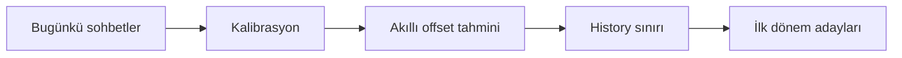
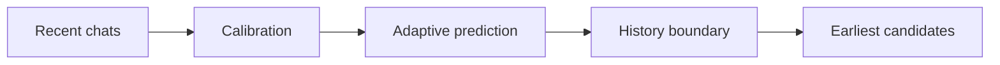
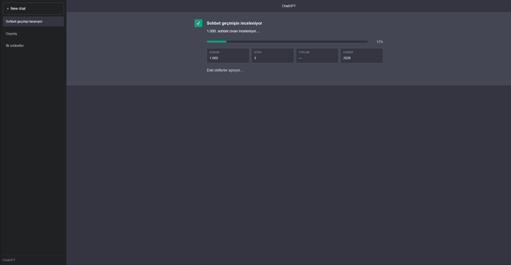
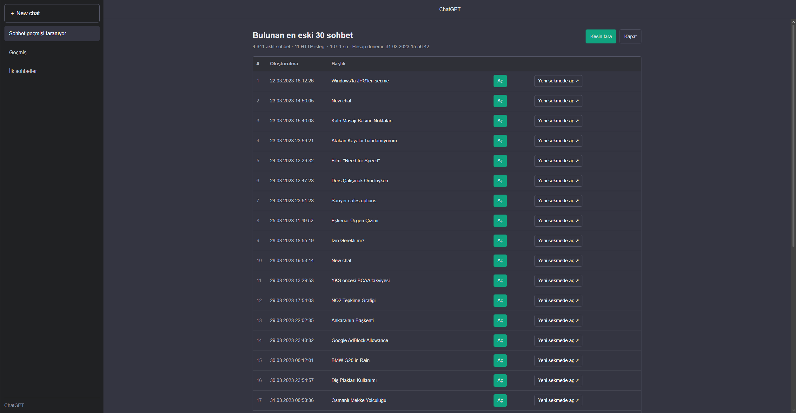

<div align="center">

# 🕰️ Find Your First Chat on ChatGPT

### *ChatGPT'ye ilk ne sormuştun?*  
### *What was the first thing you ever asked ChatGPT?*

**Yıllar süren sohbet geçmişinde geriye git. İlk konuşmalarını saniyeler içinde bul.**  
**Travel back through years of ChatGPT history and rediscover your earliest conversations.**

<br>


<br>

[🇹🇷 Türkçe](#-türkçe) · [🇬🇧 English](#-english)

</div>

---

## ✨ Ne yapıyor?

ChatGPT'de yüzlerce veya binlerce konuşman varsa en eski sohbetine ulaşmak beklediğinden daha zor olabilir.

**Find Your First Chat**, ChatGPT'nin web arayüzünde çalışan küçük bir tarayıcı aracıdır.  
Veri dışa aktarma mailini beklemek yerine, hesabının sohbet geçmişini akıllı şekilde tarar ve en eski konuşmalarını bulmaya çalışır.

```text
Bugün
  │
  ├── 2026
  │
  ├── 2025
  │
  ├── 2024
  │
  └── 2023  ← ilk sohbetlerin burada olabilir
```

### Öne çıkanlar

| | Özellik |
|---|---|
| ⚡ | Binlerce sohbet içinde körlemesine tek tek ilerlemek yerine adaptif arama yapar |
| 🧠 | Hesabın başlangıç dönemini ve sohbet zamanlarını arama için kullanır |
| 🕰️ | Sonuçları eski ChatGPT görünümünü andıran nostaljik bir arayüzde gösterir |
| 💬 | Bulunan sohbetleri aynı arayüz içinde okuyabilirsin |
| ↗️ | İstersen sohbeti normal ChatGPT'de yeni sekmede açabilirsin |
| 📊 | Tarama sırasında yüzde ilerleme, dönem ve bulunan konumu gösterir |
| 😄 | Beklerken küçük sürpriz mesajlar gösterir |
| 🔎 | İsteğe bağlı **Kesin Tara** modu ile erişilebilir sohbet metadata sayfalarını tamamlar |
| 🔐 | Harici sunucu veya API anahtarı gerektirmez |

---

# 🇹🇷 Türkçe

## 🚀 Kullanım

> Masaüstü Chrome, Edge veya Chromium tabanlı bir tarayıcı önerilir.

### 1. ChatGPT'yi aç

ChatGPT hesabına giriş yap ve normal sohbet ekranını açık bırak.

### 2. Geliştirici Konsolu'nu aç

**Windows / Linux**

```text
F12
```

veya:

```text
Ctrl + Shift + J
```

**macOS**

```text
⌘ + Option + J
```

### 3. Script'i kopyala

Repo içindeki:

```text
history-explorer.js
```

dosyasının tamamını kopyala.

### 4. Console'a yapıştır

Developer Tools → **Console** sekmesine gel.

Kodu yapıştır ve:

```text
Enter
```

tuşuna bas.

### 5. Zamanda geriye git 🕰️

Tarama ekranı açılacak.

```text
0%  ━━━━━━━━━━━━━━━━━━━━━━━━━━━━━━━━━━━━━  100%
     geçmiş taranıyor...
```

Araç:

1. hesabın başlangıç dönemini belirler,
2. sohbet geçmişinde akıllı sıçramalar yapar,
3. geçmişin son sınırını bulur,
4. ilk dönem konuşmalarını çıkarır,
5. en eski bulunan sohbetleri listeler.

---

## 🖥️ Sonuç ekranı

Tarama tamamlandığında yaklaşık olarak şöyle bir liste görürsün:

| # | Oluşturulma | Başlık | |
|---:|---|---|---|
| 1 | 22.03.2023 | Windows'ta JPG'leri seçme | **Aç** |
| 2 | 24.03.2023 | İlk eski sohbetlerinden biri | **Aç** |
| 3 | 26.03.2023 | Bir başka konuşma | **Aç** |

### `Aç`

Sohbeti nostaljik, eski ChatGPT tarzındaki okuyucu içinde açar.

### `Yeni sekmede aç ↗`

Konuşmayı doğrudan normal ChatGPT arayüzünde açar.

---

## 🎯 Hızlı Tarama vs. Kesin Tarama

### ⚡ Hızlı Tarama

Varsayılan moddur.

Tüm geçmişi baştan sona indirmek yerine sohbet dağılımından faydalanarak ilk dönem konuşmalarını hızlıca arar.



Çoğu kullanıcı için önerilen mod budur.

### 🔬 Kesin Tara

Sonuç ekranındaki **Kesin tara** butonuna basarsan, araç erişilebilir normal sohbet metadata sayfalarının eksik kalanlarını tamamlar.

Bu mod:

- daha fazla istek yapar,
- daha uzun sürebilir,
- fakat `create_time` açısından daha güçlü bir doğrulama sağlar.

---

## 🧠 Neden hızlı?

Normal yaklaşım şöyle olurdu:

```text
100
200
300
400
500
600
...
```

Bu araç bunun yerine hesabın yaşını ve gördüğü gerçek sohbet tarihlerini kullanarak yaklaşık olarak:

```text
0
1000
3100
6200
4600
```

gibi büyük ama kontrollü sıçramalar yapabilir.

Amaç sunucuya mümkün olduğunca az gereksiz istek göndererek sohbet geçmişinin sınırını bulmaktır.

---

## 🔐 Gizlilik

Bu proje özellikle **harici backend kullanmadan** çalışacak şekilde tasarlanmıştır.

Script:

- kendi tarayıcında çalışır,
- açık olan ChatGPT oturumunu kullanır,
- harici bir veri toplama sunucusuna sohbetlerini göndermez,
- API key istemez.

### Asla paylaşmaman gerekenler

```text
accessToken
HAR dosyaları
ChatGPT data export ZIP dosyaları
hesap ID'leri
kişisel sohbet JSON'ları
oturum bilgileri
```

> Kodu kullanmadan önce kaynak kodunu kendin incelemen her zaman iyi fikirdir.

---

## ⚠️ Önemli

Bu proje **OpenAI tarafından geliştirilmemiştir, desteklenmez ve onaylanmamıştır.**

ChatGPT web uygulamasındaki belgelenmemiş dahili endpoint'lere dayanır.  
OpenAI arayüzü veya endpoint'leri değiştirirse script'in bazı bölümleri çalışmayı durdurabilir.

Yalnızca **kendi hesabında** kullan.

---

## 🧩 Neler taranıyor?

Varsayılan sürüm yalnızca normal, aktif sohbet geçmişini tarar.

```text
✅ Normal aktif sohbetler
❌ Arşivlenmiş sohbetler
❌ Yıldızlı sohbetler için ayrı tarama
```

Bu tercih taramayı daha hızlı ve daha sade tutmak içindir.

---

## ❓ Sık Sorulanlar

<details>
<summary><b>Bu gerçekten ilk sohbetimi kesin olarak bulur mu?</b></summary>

Hızlı mod güçlü bir aday listesi çıkarır ancak geçmiş listesi `update_time` sırasına göre çalıştığı için yıllar sonra güncellenmiş çok eski bir sohbet farklı bir konumda bulunabilir.

Daha kapsamlı kontrol için sonuç ekranındaki **Kesin tara** seçeneğini kullan.

</details>

<details>
<summary><b>Data Export istemem gerekiyor mu?</b></summary>

Hayır. Projenin ana amacı zaten export mailini beklemeden geçmiş içinde arama yapabilmek.

</details>

<details>
<summary><b>API key gerekiyor mu?</b></summary>

Hayır.

</details>

<details>
<summary><b>Sohbetlerim başka bir sunucuya gidiyor mu?</b></summary>

Bu sürümde hayır. Script tarayıcı içinde çalışır ve ChatGPT'nin kendi oturum endpoint'leriyle iletişim kurar.

</details>

<details>
<summary><b>Mobilde çalışır mı?</b></summary>

Tarayıcı console erişimi nedeniyle masaüstü kullanım çok daha pratiktir.

</details>

---

# 🇬🇧 English

## 🚀 Usage

> Desktop Chrome, Edge, or another Chromium-based browser is recommended.

### 1. Open ChatGPT

Log in to your ChatGPT account and keep the normal chat interface open.

### 2. Open Developer Console

**Windows / Linux**

```text
F12
```

or:

```text
Ctrl + Shift + J
```

**macOS**

```text
⌘ + Option + J
```

### 3. Copy the script

Open:

```text
history-explorer.js
```

and copy the entire file.

### 4. Paste it into Console

Open Developer Tools → **Console**, paste the script, and press:

```text
Enter
```

### 5. Travel back in time 🕰️

The scanner UI will appear and begin navigating your ChatGPT history.

It will:

1. estimate your account's starting period,
2. intelligently probe your conversation history,
3. find the end of the history,
4. inspect your earliest period,
5. show the oldest conversations it found.

---

## ✨ Features

| | Feature |
|---|---|
| ⚡ | Adaptive search instead of blindly scanning every conversation |
| 🧠 | Uses account age and real conversation timestamps |
| 🕰️ | Classic ChatGPT-inspired interface |
| 💬 | Read conversations directly inside the nostalgic UI |
| ↗️ | Open any result in normal ChatGPT in a new tab |
| 📊 | Live progress percentage and scan status |
| 😄 | Small loading jokes while the scan runs |
| 🔎 | Optional **Exact Scan** mode |
| 🔐 | No external backend or API key required |

---

## ⚡ Quick Scan vs. Exact Scan

### Quick Scan

The default mode uses a small number of strategic requests to estimate where the beginning of your history is.



### Exact Scan

Press **Exact Scan** after the quick scan to fill in missing accessible conversation metadata pages.

It takes longer and makes more requests, but provides a stronger global `create_time` check.

---

## 🔐 Privacy

The script is designed to run entirely inside your browser.

It:

- uses your existing logged-in ChatGPT session,
- does not require an API key,
- does not upload your conversations to an external backend.

Never publish:

```text
access tokens
HAR files
ChatGPT export archives
account IDs
conversation JSON dumps
session credentials
```

---

## ⚠️ Disclaimer

This is an **unofficial community project**.

It is not developed, endorsed, or supported by OpenAI.

The project relies on undocumented/internal ChatGPT web endpoints, so future ChatGPT updates may break parts of it.

Use it only with your own account.

---

## 🛠️ Project Structure

```text
find-your-first-chat/
│
├── README.md
├── history-explorer.js
├── LICENSE
└── assets/
    ├── scan.png
    └── results.png
```

> `assets/scan.png` and `assets/results.png` are optional screenshots for the README.

---

## 📸 Screenshots

<div align="center">

### Scanning



<br><br>

### Results



</div>

> Until you add screenshots, these images may appear broken on GitHub.  
> Add your own screenshots under the `assets/` directory.

---

## 🤝 Contributing

Found a bug after a ChatGPT frontend update?

PRs are welcome.

Especially useful contributions:

- endpoint compatibility fixes,
- browser compatibility improvements,
- UI fixes,
- safer/faster history scanning strategies.

---

## ⭐ Like it?

If this made you rediscover a conversation you had completely forgotten about, leave a ⭐ on the repo.

And then go read whatever you were asking ChatGPT in 2023.

You probably had a reason.

---

<div align="center">

### 🕰️ Find Your First Chat

**What was the first thing you ever asked ChatGPT?**

Made for curiosity, nostalgia, and people with way too many chats.

</div>
